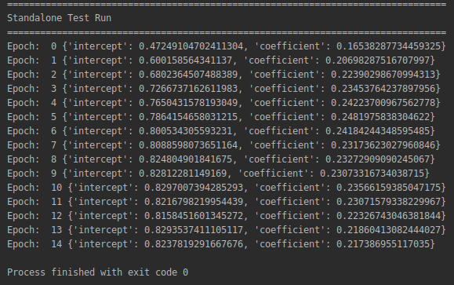
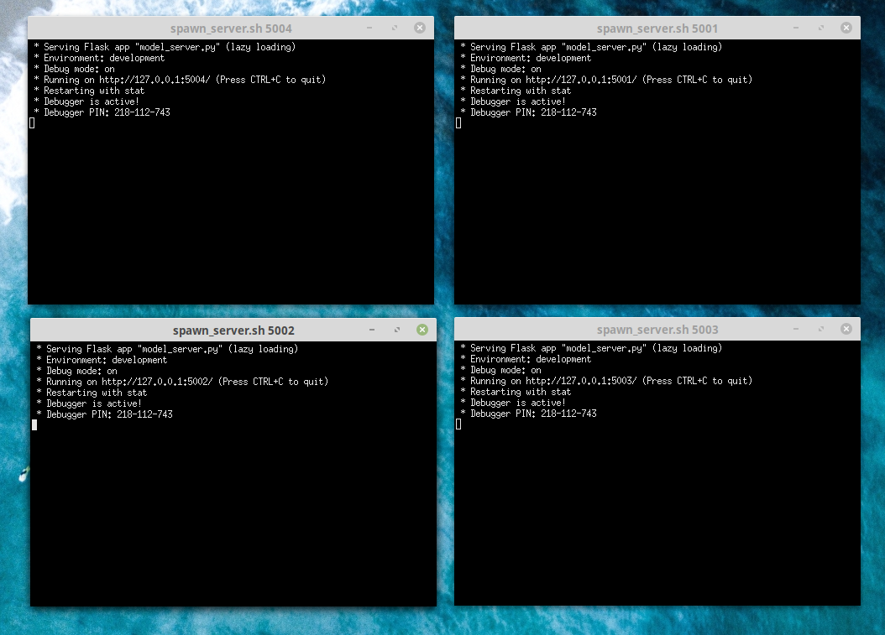
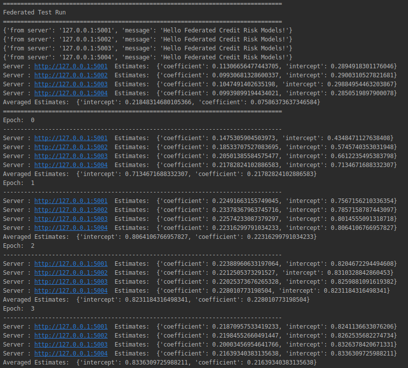

# Illustration of federated estimation of LGD models

## General Preparation
* Clone the repo in a local _linux_ environment (experienced users could probably reproduce this on a Windows environment with small modifications of the scrips)
* Install the dependencies (a virtual environment is recommended)

### Do a standalone run as a check
Make a standalone test run to ensure the local environment / paths / dependencies are properly setup. 
* cd openLGD
* python standalone_run.py

You should get a screenshot like this:

## 1. Simple File Based Federated Demo
In the first demo each federating model server has a local copy of the data from the filesystem 

### Spawn a cluster of model servers
* Fire up a number of flask servers on different xterm shells. 
* Run the [Spawn Cluster Script](./spawn_cluster.sh)
* **Note**: The script uses ports 5001-5004. If by any chance you are already using these ports you would need to adapt the script

If all goes well you should get four xterminals with a flask server active in each one:
    

- The model servers should startup on ports http://127.0.0.1:500X/ where X is the serial number
- You can check the servers are live by pointing your browser to the ports
- or by using curl from the console (curl -v http://127.0.0.1:500X/)

#### Model Server API endpoints: 
The general structure of the simplified API is

* GET http://127.0.0.1:500X/          API Root, indicating the server is live
* GET http://127.0.0.1:500X/start     URL to get initial locally estimated parameters (cold start)
* POST http://127.0.0.1:500X/update   URL to post current averaged parameters (warm start) 

### Run the federated calculation
* Run the [federated_run](./federated_run.py) script to perform the federated estimation calculation. If all goes well you should get the following screenshot
* the first messages confirm the servers are live and print the first local estimates send to the coordinating node
* subsequent blocks show a number of iterative estimates (epochs) where the averaged model parameters are sent back to the local servers and used to obtain the next local estimate 

## 2. Federated Demo using openNPL backends

### Spawn a cluster of docker containers each running an openNPL instance. Those are the data backends
* Fire up a number of flask servers on different xterm shells. 
* Run the [Spawn Cluster Script](./spawn_cluster.sh)
* **Note**: The script uses ports 5001-5004. If by any chance you are already using these ports you would need to adapt the script

### Spawn a cluster of model servers
* fab deploy_cluster

### Run the federated calculation
* Run the [federated_run](./federated_run.py) script to perform the federated estimation calculation. If all goes well you should get the following screenshot

### Clean Up
* fab stop_cluster
* docker stop $(docker ps -a -q)

  

